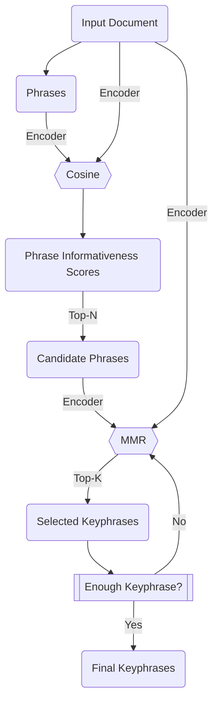

# Paper Note -- [Simple Unsupervised Keyphrase Extraction using Sentence Embeddings](https://arxiv.org/abs/1801.04470)

## Overview
Proposed an algorithm called **EmbedRank** used for keyphrase extraction.

### Ideas
* Modeling keyphrase extraction to **phrases ranking** and **candidate phrases selection problem**.
    * **Phrases Ranking**: Select phrases which has higher **informativeness**.
        * **Informativeness** is quantified by **semantic similarity**, the selected phrases are **candidates**.
    * **Candidate Phrases Selection**: The selection is not only based on **informativeness**, but also based on **redundancy**. 
        * **Redundancy** is quantified by calculate highest **semantic similarity** between each candidate phrase and selected phrase. Higher similarity means higher redundancy.
        * **MMR**: Candidate phrase selection algorithm, which is a iterative process. Each time put phrase with highest combination score of **informativeness** and **redundancy** into selected phrases set.
  
### Pros
* **Zero Resource Needed**
    * **Encoder** used for semantic similarity calculation is not necessarily fine-tuned, can just use pre-trainined LM like BERT.
* **Unsupervised Learning** 
    * Even we need fine-tune encoder model with domain specific, we do not need labeled dataset.

### Cons
* It's based on text segmentation, for short text summarization scenario, it's hard to segment it into phrases. 
* When key-points in source document takes smaller amount of text, it's hard to retrive it based on semantic similarity with source document.
* Key points are not necessarily highly related with full document.

## Algorithm
### Steps
* Candidate Phrases Extraction
    * Calculate embedding $Q$ for full document.
    * Split text into phrases
    * For each phrases
        * Calculate embedding $D_i$ for each phrase.
        * Calculate **informativeness** score for each phrase: $Sim_i = Cos(D_i, Q)$.
    * Select top-k phrases with highest **informativeness** $Sim_i$ as candidates. 
* Keyphrases Selection (**MMR** algorithm)
  * Initialize **selected phrases** as an empty set $S$.
  * Decide $\lambda$ in **MMR** formula, $\lambda$ represents **informativeness** ratio in $MMR$ score, and $1 - \lambda$ represents ratio of **redundancy**.
  * While need selecting more keyphrase:
      * For each candidate phrases $C_i$:
          * Calculate **informativeness** score: $Cos(C_i, doc)$, the higher the better.
          * Calculate **redundancy** score: $max_{C_j \in S}Cos(C_i, C_j)$.
          * Calculate **MMR** with **informativeness** score and **redundancy** score: $MMR = \lambda \cdot Cos(C_i, doc) - (1 - \lambda) \cdot max_{C_j \in S}Cos(C_i, C_j)$. 
      * Select candidate with highest $MMR$ and insert it into $S$
  * Get final extracted keyphrases.

### Flowchart

## Implementations
The most convinent implementation is [KeyBERT](https://github.com/MaartenGr/KeyBERT). Even though this is not specifically developed according to the paper, by tuning the parameters we can make the logic align with this paper.

## Something to Discover
* How performance change before and after fine-tuning encoder model?
* Besides cosine similarity, is there any better ranking metrics?